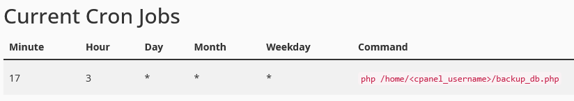

# simple_db_backup
A simple script you can call via CRON to do database backups. 
This script is meant to be run from the command line and/or CRON and should not be placed in a location where it can be web accessible.

1. Setup Username and Password in MySQL file .my.cnf and place in the root of the users home directory
2. Edit configuration values at the top of backup_db.php and place in the root of the users home directory
3. (Optional) Setup CRON to run at interval desired 
```
php /home/<cpanel_username>/backup_db.php
```

